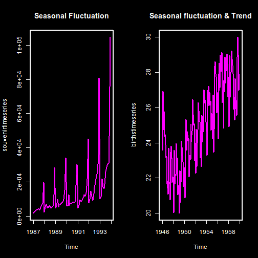
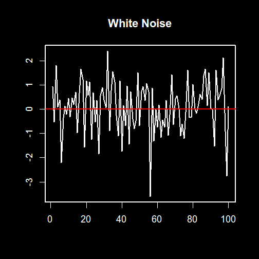
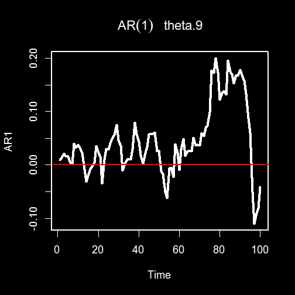
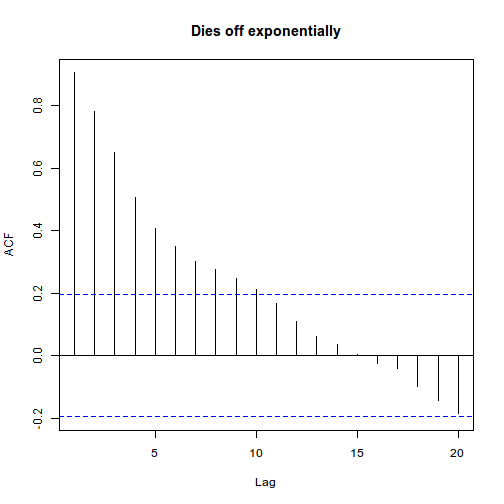
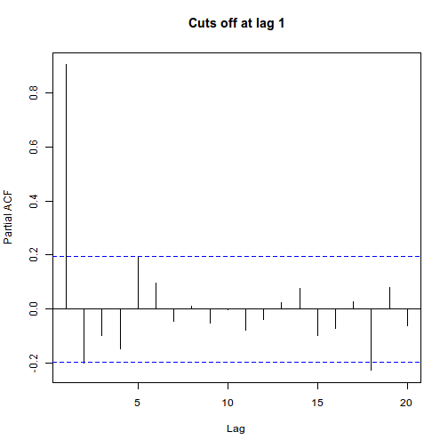
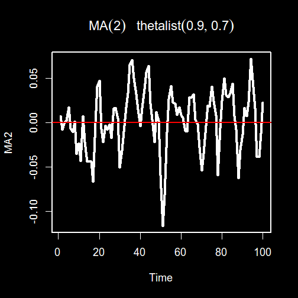
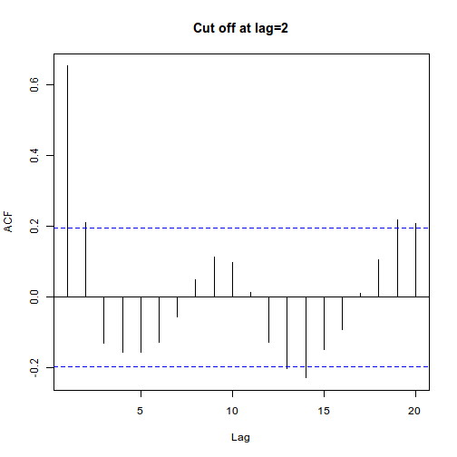
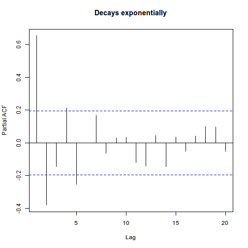
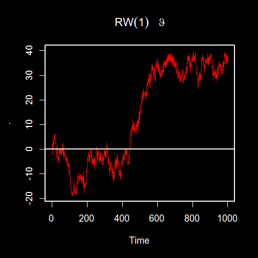

# Outline

- Introduction

- Fundamental concepts of time series analysis

- Measures of dependence

- Components of time series

- Introduction to stationary time series models

# Definition
- Time series is a series of data points listed (or graphed) at a specific time.

- Time series analysis aims to describe the data for purposes of forecasting.

- Ostensibly this is done through finding the appropriate model for the time series data.

- With TS data, we are interested in measuring the dependence between the values in the series

-- Definition cont'
- **How different is Time Series data from other data?**
- Data is collected over time.
- The order of the data is important. e.g $X_{t+1}> X_t$  (have a nutural order)
- Data is **correlated**. Previous observation is related with the current.\\
Hence statistical methods that takes into account the autocorrelation are necessary.

# Time series analysis

* Analysis can either be:
  * Frequency Domain (Tool used Spectrum density function)
     + Density analysis
  * Time Domain (Tool used is Correlogram)
     + Seasonal Decomposition Approach
     + Box-Jenkinson Appoach

$\textit{NB:}$ Any Domain can be expressed in terms of another dormain through $Fourier\,Transform$

**Time Domain**
- A typical Timeseries is expressed as $X_t= \mu_t + S_t + C_t + \varepsilon_t$
- **Seasonal Decomponsition Approach**
* In this approach, a time series  $(X_t)$  is broken down into its consitituents namely:
     + Trend  $(\mu_t)$
     + Season  $(S_t)$ (Fluctuations are of a fixed period)
     + Cyclic  $(C_t)$  (Fluctuations not of a fixed period)
     + Random Noise  $(\varepsilon)$
* Each of these component is estimated  such that the forecasted series becomes;
     + $X_t= \hat \mu_t + \hat S_t + \hat C_t + \hat \varepsilon_t$

**Series with Trend and Seasonal component**

# Box-Jenkinson Appoach
This approach Models the correlation patterns in the Time series based on the weak assumption of **Stationarity**
* Whats __stationarity__?
    + a Stationary process is a stichastic process whose joint probability distribution does not change when shifted in Time or Space.
    + In other words, statistical properties of the series remain constant over time.
    + Statistical properties here we mean **Expectation and  Covariance**
        + Expectation should remain constant and
        + Covariance should not be a function of time.

**Example of stationary series(White Noise)**
<br\>

# Models for Stationary data
   - Moving Average process MA(q)- Its a process that can be expressed in terms of its residual while                   forecasting  $X_t=\theta \varepsilon_{t-1}+ \varepsilon_t$
     - Autoregressive process AR(p) - Its a process that can be expressed in terms of its previous               values in order to forecast     $X_t=\theta X_{t-1}+ \varepsilon_t$
     - Autoregressive Moving Average ARMA(p,q)- Combination of MA and AR

# Determining AR or MA process

**Rule of thump**
Use of Autocorrelation function(ACF) and partial autocorrelation function(PACF) as follows;
* AR(p)
     + Its ACF decays with increase of lag
     + Its PACF is cut-off at lag(P)
* MA(q)
     + Its ACF cut of at lag (q)
     + Its PACF decays with increase in lag

**Examples AR(1)**

**ACF of AR**

**PACF of AR**

**Examples MA(2)**

**ACF of MA(2)**

**PACF of MA(2)**

**Non-stationary Series(Random walk)**

# Stationarizing a series

* Methods of making a non-Stationary series stationary
   + Differencing = Difference between any two adjacent series (ARIMA models)
   + Detrending = Elimination of trend component from the series
   + Deseasonalizing = Elimination of Seasonal component from the series

# Summary
- Timeseries is a correlated data
- Time series analysis can either be Time or Frequency domain
- Time Domain analysis are split into Seasonal decomposition and Box-jenkson approaches
- Box-jenkson approaches work for both Stationary(AR, MA, ARMA) and  non-stationary(ARIMA, SARIMA) processes.
- ACF and PACF are essential in determining the stationary processes and their appropriate order.
- In Non-stationary series use ARIMA to model or difference before applying AR or MA models.

